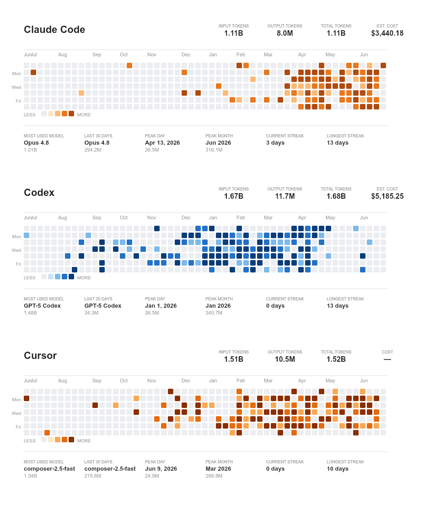

<div align="center">

# aitrack + opentrack

**Your AI coding usage in the terminal and the menu bar.**

Track Claude Code, Codex and Cursor with two apps built on the same usage data:
**aitrack** for reports and git sync, **opentrack** for live limits and a desktop dashboard.

[](https://www.npmjs.com/package/aitrack)
[](https://github.com/bircni/aitrack/actions/workflows/ci.yml)
[](https://nodejs.org)
[](LICENSE)

[Install the CLI](#aitrack-command-line-app) · [Download the desktop app](https://github.com/bircni/aitrack/releases) · [Documentation](#documentation)

</div>

## Choose your app

|                | aitrack                                   | opentrack                                              |
| -------------- | ----------------------------------------- | ------------------------------------------------------ |
| Where it runs  | Terminal on macOS, Windows and Linux      | macOS menu bar and Windows system tray                 |
| Main use       | Usage reports, heatmaps, exports and sync | Live limits, reset times, pacing and usage at a glance |
| Providers      | Claude Code, Codex and Cursor             | Claude Code, Codex and Cursor                          |
| Install        | npm / npx                                 | Download a desktop installer                           |
| Shared history | Optional git repo you control             | Reads the same history and can sync from the dashboard |

Use either app on its own, or both together. There is no aitrack account or telemetry.

## aitrack command-line app

Preview your local usage without configuring a sync repo:

```sh
npx aitrack show --tui
npx aitrack usage today
npx aitrack show
```

Or install the CLI once:

```sh
npm install -g aitrack
```

The CLI needs **Node.js 24+**. Git is needed for cross-machine sync.



- View daily usage by provider and model, or choose a calendar or rolling period.
- Compare usage with the previous period and rank your busiest days or models.
- Render PNG heatmaps and export PDF or CSV reports.
- Inspect machine totals and sync Claude Code and Codex history across computers.

```sh
aitrack usage thismonth --compare
aitrack top models
aitrack export month --csv
```

[CLI guide: commands, configuration and data sources](docs/cli.md)

## opentrack desktop app

See how much of your allowance is left without leaving your work. opentrack shows live
provider limits alongside the usage history and cost estimates used by aitrack.

- Session, weekly and per-model limits where the provider exposes them.
- Reset times, pacing indicators and notifications when limits are running low.
- Today, yesterday and 30-day usage with daily trends and model breakdowns.
- A configurable tray icon or bars for your available limits, with colour or monochrome rendering.
- A floating dashboard, global shortcut and optional launch at login.

Download opentrack from [GitHub Releases](https://github.com/bircni/aitrack/releases):

| Platform                   | Download         | Install                                                |
| -------------------------- | ---------------- | ------------------------------------------------------ |
| Windows                    | `.exe` installer | Run the installer                                      |
| macOS 13.5+, Apple Silicon | `aarch64.dmg`    | Open the disk image and drag opentrack to Applications |

The desktop app bundles its runtime; you do not need to install Node.js or the CLI to
view local usage and limits. Sign in to Claude Code, Codex or Cursor as usual: opentrack
reads their saved credentials. Codex live limits require a ChatGPT login.

Windows builds are unsigned; macOS builds are ad hoc signed and not notarized.
SmartScreen or Gatekeeper may block the first launch.

[Desktop guide: limits, credentials, settings and sync](docs/opentrack.md)

## Share history across machines

Create an empty git repository you control, then run the CLI on each machine:

```sh
aitrack init
aitrack sync
```

Use the same remote and a different, stable machine name for each computer. Your normal
git credentials handle authentication. The desktop app reads the same configured repo,
can pull history automatically, and pushes local usage when you press Sync.

Claude Code and Codex history are synced. Cursor usage stays on the current machine.
You can use both apps locally without setting up a repo.

## Your data and cost estimates

Claude Code and Codex usage comes from local session logs. Cursor usage comes from its
HTTPS usage export using the current machine's saved Cursor login. opentrack also
requests live limits from each provider using the credentials that provider's tool saved.
Credentials are never written to your usage repo.

Costs are **API-equivalent estimates**, based on model pricing and token/cache counts.
They show the pay-as-you-go value of your usage, not your subscription bill.

The CLI selects all three providers by default. To skip Cursor credentials and requests:

```sh
aitrack show --tui --providers claude,codex
```

## Documentation

- [CLI guide](docs/cli.md) — commands, reports, configuration, sync and data format.
- [Desktop guide](docs/opentrack.md) — live limits, credentials and desktop behaviour.
- [Library guide](docs/library.md) — use `aitrack-lib` in your own tools.
- [Contributing](CONTRIBUTING.md) — development setup, project layout, checks and releases.
- [Changelog](CHANGELOG.md) — changes across both apps and the shared library.

## Acknowledgements

opentrack's provider research and pacing model build on [OpenQuota](https://github.com/deviffyy/OpenQuota) (MIT).

## License

[MIT](LICENSE)
